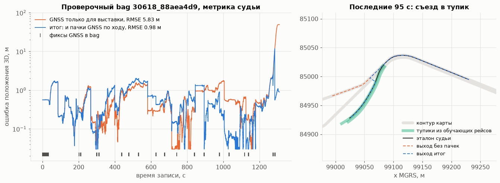
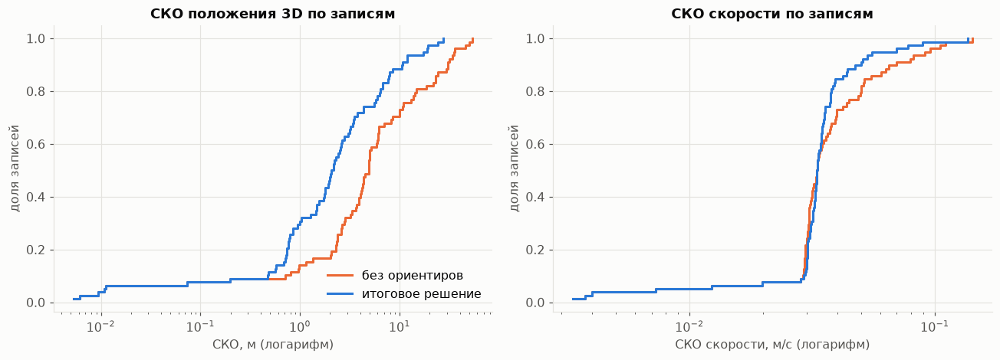
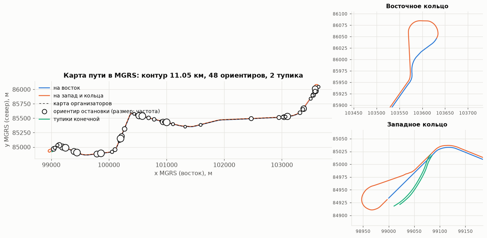
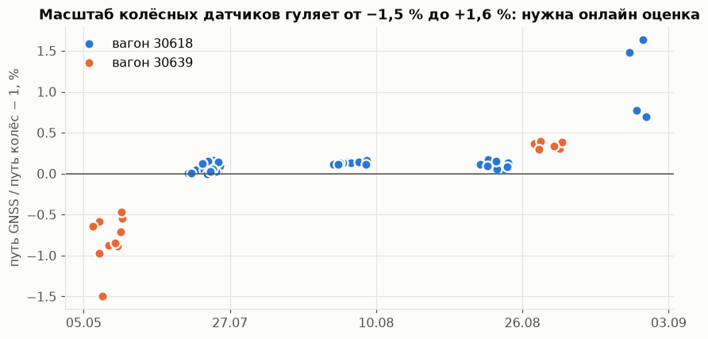
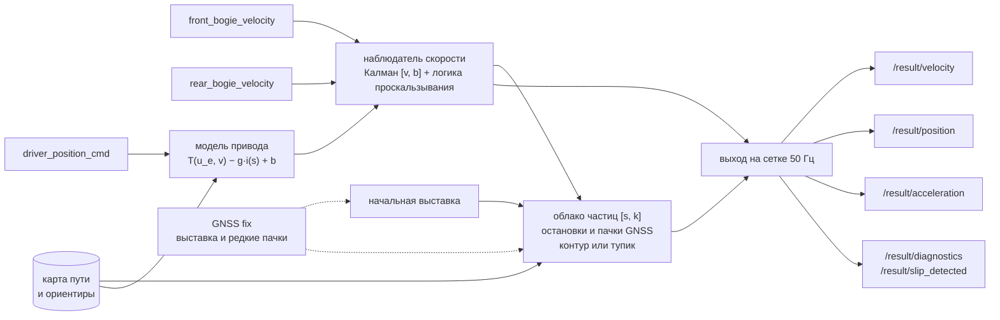
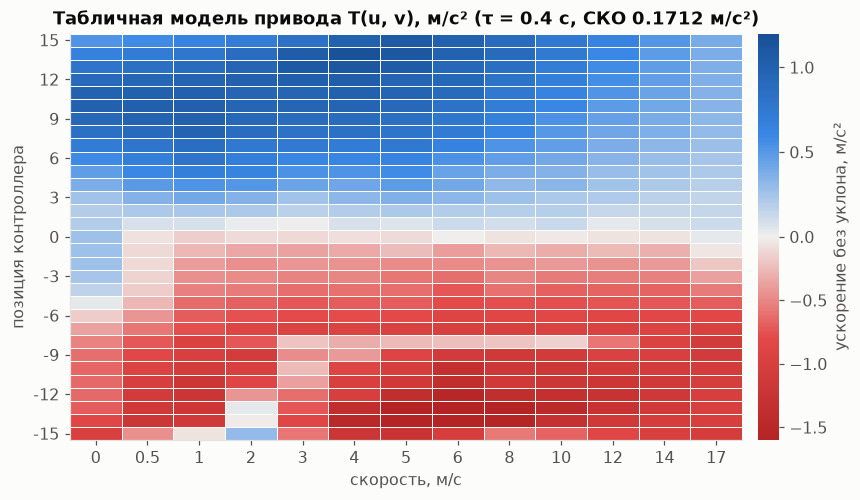
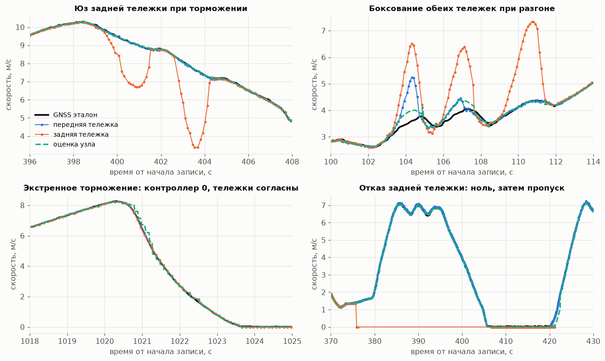
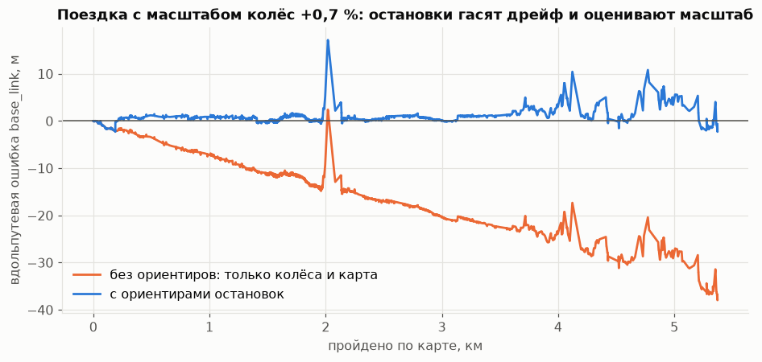

# одометрия 

посмотреть красоту по кейсу можно тут: [predel-ai.ru](https://predel-ai.ru/)

Пакет ROS 2 Humble, который по трём внутренним сигналам (позиция контроллера водителя, скорость передней и задней тележек) в реальном времени оценивает ускорение, скорость и положение трамвая без IMU. GNSS нужен для начальной выставки и, как разрешили организаторы, редкими пачками по ходу рейса для коррекции вдоль пути и выбора тупика конечной; при `gnss_correction: false` подписки на GNSS после выставки уничтожаются. Положение `base_link` публикуется в плоских координатах MGRS с высотой, как ответили эксперты кейса, в той же системе, что и карты организаторов.

Решение состоит из трёх связанных частей:

1. **Нелинейная модель тягового привода и продольной динамики**: табличная характеристика `T(u, v)`, апериодическое звено привода, уклон пути из карты, адаптивная поправка.
2. **Наблюдатель скорости** (фильтр Калмана `[v, b]`) с распознаванием юза, боксования, отказа датчика и экстренного торможения.
3. **Привязка к карте пути**: основной ход из карт организаторов, кольца и тупики конечных по RTK обучающих поездок, облако частиц по дуговой координате и масштабу колёс, которое уточняется на каждой остановке у платформы и по пачкам GNSS.

## Ответы экспертов и как они учтены

| Вопрос | Ответ экспертов | Что сделано |
|---|---|---|
| Система координат `/result/position` | плоские координаты MGRS | UTM зона 37 по эллипсоиду WGS84 (ряды Крюгера, точность лучше 1 мм) минус угол квадрата сетки 300 000 / 6 100 000 м. Проверено: RTK фиксы ложатся на карты организаторов с медианой поперёк пути 3 см |
| z и антенны | z это высота по REP 103; антенны 1 и 2 разнесены, tf дан отдельно | tf в `base_link`: master x = −9,873 м, rover x = 2,563 м, обе z = 3,0 м. Выход для `base_link`: точка на хорде антенн, высота антенн минус 3,0 м. Высоты карт организаторов ровно на 3,10 м ниже антенн, то есть карты описывают `base_link` |
| Эталонная скорость | отдельного эталона нет, есть 2 тележки и 2 GNSS | оценка по модулю скорости GNSS, выход продольная скорость |
| Проигрывание bag | как удобно | узел работает при любой скорости проигрывания, проверено ×1 и ×4 |
| Карта | прислана отдельно | основной ход взят из неё; на 400 м западного хода она исправила нашу карту, где 27 июля был объезд по соседнему пути |
| Единицы колёс | км/ч | коэффициент 1/3,6 |

## Комментарии организаторов и проверочный bag

| Комментарий организаторов | Что сделано |
|---|---|
| GNSS топики использовать можно: «допускается, запрета нет», комментарии в процессе решения превалируют | GNSS нужен для начальной выставки и дальше редкими пачками для коррекции вдоль пути и выбора тупика конечной. Если жюри засчитает только выставку, достаточно `gnss_correction: false`: подписки на GNSS после выставки уничтожаются |
| GNSS гарантирован в первые секунды; в середине маршрута могут быть сообщения для коррекции; к пустому топику обращаться можно | подписки живут весь рейс; фиксы копятся в пачку 0,6 с, применяется медиана пачки, если не меньше 80 % фиксов согласны; путь колёс берётся на момент метки фикса (задержка фиксов доходит до 1 с) |
| Проверяются x, y, z (3D); z как в файлах pathgraph; эталон `base_link` | `base_link` ставится на линию карты на 9,873 м впереди master по дуге, z это высота карты. На проверочном bag СКО по z 0,04 м |
| Проверяется только 30618, учёт отличий вагонов плюс | масштаб колёс оценивается онлайн в каждом рейсе; ориентиры общие для 30618 и 30639 |
| Записи начинаются и кончаются у колец Щукинская и Таллинская | в карту добавлены тупики западной конечной: в проверочном bag рейс кончается в тупике, в который ведёт съезд |
| Проверочный скрипт `check-code` («аналог того, как будет проверяться решение») | эмулирован офлайн тем же алгоритмом сопоставления (`tools/judge_check.py`) и запущен как есть в `ros:humble` вместе с узлом (`tools/judge_ros.sh`) |

Проверочный bag `30618_88aea4d9` (1312 с, эталон `/localization/kinematic_state`), метрики судьи:

| Версия | Скорость RMSE | Положение RMSE 3D | Медиана | Максимум |
|---|---:|---:|---:|---:|
| Предыдущий коммит | 0,0544 м/с | 5,79 м | 0,51 м | 48,6 м |
| `base_link` на линии карты, z карты, сдвиги времени эталона | 0,0243 м/с | 5,78 м | 0,53 м | 48,6 м |
| и коррекция по пачкам GNSS | 0,0245 м/с | 1,96 м | 0,56 м | 14,9 м |
| **и тупики конечной, исправленный стык карты (итог)** | **0,0245 м/с** | **0,98 м** | **0,45 м** | 11,8 м |
| итог в ROS 2 с проверочным узлом организаторов | 0,0244 м/с | 0,97 м | | 11,8 м |
| итог с GNSS только для выставки (`gnss_correction: false`) | 0,0244 м/с | 5,83 м | 0,53 м | 49,2 м |

По осям в итоге: x 0,79 м, y 0,57 м, z 0,04 м. Почти вся ошибка без коррекции набирается в последние 40 с: вагон уходит в тупик, которого нет в картах организаторов, а колёса этого не видят. Пачка GNSS в тупике переключает выход на его ломаную. Разбор проверочного bag в [`docs/DATASET.md`](docs/DATASET.md), отчёт эмулятора в [`reports/judge_check.json`](reports/judge_check.json).



## Результаты

Проверка без подглядывания на обучающих записях: для каждой записи ориентиры, тупики и собственные участки карты строятся **без всех записей того же дня** (leave-one-day-out), затем запись проигрывается через тот же код, что работает в узле. Эталона судьи в обучающих записях нет, поэтому эталон здесь `base_link` в MGRS по обеим антеннам и tf, высота антенн минус 3 м, а сдвиги времени эталона судьи выключены (`velocity_delay` и `position_lead` равны 0). GNSS в ядро подаётся как в проверочном bag: первые 32 с и пачки по 1,5 с раз в 120 с, master и rover по очереди (`replay.py --gnss bursts`); для сравнения приведён вариант только с первыми 32 с. 97 уникальных записей (25 побайтных дублей из 122 исключены), 78 с GNSS, 3,9 млн пар для положения.

| Метрика | **Итог: пачки GNSS как в проверочном bag** | GNSS только первые 32 с | Предыдущий коммит |
|---|---:|---:|---:|
| СКО скорости, медиана по записям | **0,034 м/с** | 0,033 м/с | 0,033 м/с |
| СКО скорости, все пары без сбоев эталона | **0,039 м/с** | 0,039 м/с | 0,039 м/с |
| СКО скорости, все пары | 0,113 м/с | 0,113 м/с | 0,113 м/с |
| Систематическое смещение скорости | **−0,002 м/с** | −0,002 м/с | −0,002 м/с |
| СКО положения в плане, медиана по записям | **1,36 м** | 1,47 м | 1,47 м |
| СКО положения 3D, медиана по записям | **1,64 м** | 1,71 м | 1,71 м |
| СКО положения 3D, медиана по записям с RTK эталоном | **0,94 м** | 0,92 м | 1,02 м |
| СКО положения 3D, все пары | 6,83 м | 6,89 м | 6,75 м |
| Вдольпутевая СКО, медиана | **0,85 м** | 0,94 м | 1,05 м |
| Поперечная СКО, медиана | **0,68 м** | 0,68 м | 0,69 м |
| Дрейф в конце поездки, медиана | **0,023 % пути** | 0,027 % | 0,035 % |
| Ошибка в конце поездки, медиана | **1,14 м** | 1,40 м | 1,84 м |
| Частота выхода в ROS 2 | 48 Гц (сетка 50 Гц) | | |
| Задержка «вход → публикация» через DDS, p50 / p99 / максимум | 4,0 / 9,1 / 48 мс | | |
| Память узла / загрузка CPU | 65 МБ / 13 % одного ядра | | |

С пачками GNSS точнее 35 записей из 78, хуже 10 (не больше чем на 0,95 м в плане). «Все пары» по 3D чуть выросли, потому что z теперь берётся из карты, как у эталона судьи, а высота GNSS в обучающих записях скачет на десятки метров; в плане все пары 5,66 м против 5,73 м. Отчёты: [`reports/replay_dayout_bursts.json`](reports/replay_dayout_bursts.json) и [`reports/replay_dayout.json`](reports/replay_dayout.json).

«Все пары» включают сбои самого эталона: провалы скорости GNSS в ноль на ходу и скачки его метки времени на ±1 с. Их никакое решение не повторит, поэтому отдельно приведена метрика без них. В записях 30639 от 5 мая антенна master работает без RTK и уходит на 10..30 м (база master и rover плавает до 32 м вместо 12,4), это основной вклад в хвост распределения положения. В одной записи приёмник чередует две точки в 37 м друг от друга даже со статусом 2: поэтому пачка применяется, только если почти все её фиксы согласны, а сдвиг больше 3 м принимается, когда его подтверждает следующая пачка.



Вклад каждой части (все пары, отложенные дни, версия до коррекции по GNSS): без карты положение уходит на километры, потому что из трёх скалярных сигналов повороты не восстановить; карта без ориентиров даёт 16,0 м; ориентиры с фильтром Калмана 9,5 м; облако частиц 6,75 м. Подробности в [`reports/ablation.json`](reports/ablation.json).

## Сравнение с решением сокомандника и объединение

Оба решения прогнаны на одинаковых фолдах (карта и таблица привода без дня проверяемой записи), каждое со своим реальным потоком публикаций, одна функция метрик, все точки из `/result/position`, как у судьи, общие эпохи эталона. Подробности в [`reports/comparison_teammate.json`](reports/comparison_teammate.json).

| | Наше до объединения | Сокомандник | **Объединённое** |
|---|---:|---:|---:|
| Скорость RMSE, все пары | 0,1131 | 0,1154 | **0,1130** |
| Скорость RMSE без сбоев эталона | 0,0370 | 0,0438 | **0,0369** |
| Положение RMSE, все пары | 7,038 м | 8,772 м | **6,815 м** |
| Положение RMSE, строгий RTK | 3,929 м | 3,387 м | **3,364 м** |
| Без 4 записей с плохим эталоном | 5,225 м | 4,898 м | **4,885 м** |
| Медиана по записям | 1,867 м | **1,511 м** | 1,692 м |
| Худшая запись | 27,0 м | 46,4 м | 27,1 м |

Медиана по записям у сокомандника ниже из-за разрыва распределения около середины: по каждой записи отдельно разница в пользу объединённого решения, оно точнее в 45 из 78 записей. Из его решения взяты наблюдатель скорости (вес опоздавших колёс, запрет ложного реверса, флаги общего боксования и неоднозначности), строгий выбор пути на старте и честный разброс облака частиц. Не взяты выбор антенны rover (выигрыш 1,8 м на одной короткой записи и десятки метров потерь на двух других), публикация по таймеру и публикация недостоверного положения, которое судья всё равно посчитает. Главный выигрыш дало новое: правдоподобие ориентира с тяжёлым хвостом. Раньше остановка на 3,7 м раньше обычного места у частой платформы сбивала масштаб колёс, и ошибка к концу рейса доходила до 20 м; теперь такая остановка почти не влияет.

## Быстрый старт для жюри

Ubuntu 22.04, ROS 2 Humble, внешний интернет не нужен.

```bash
source /opt/ros/humble/setup.bash
git clone https://github.com/temurysega/odometria.git odometria_ws && cd odometria_ws
colcon build --symlink-install
source install/setup.bash
ros2 launch odometria odometria.launch.py
```

Пакет `tram_vehicle_msgs` из архива организаторов в чистом Humble не собирается: в его `package.xml` нет обязательного поля maintainer, и `colcon build` падает. В репозитории это поле добавлено, определения сообщений не менялись.

Во втором терминале воспроизвести любую запись:

```bash
source /opt/ros/humble/setup.bash && source odometria_ws/install/setup.bash
ros2 bag play /path/to/data/30618_01f73500
```

Выходные топики:

| Топик | Тип | Содержимое |
|---|---|---|
| `/result/velocity` | `tram_vehicle_msgs/VelocitySensor` | продольная скорость, м/с |
| `/result/position` | `nav_msgs/Odometry` | положение `base_link` в плоских MGRS (x восток, y север) и высота z, курс по хорде антенн в сетке MGRS, скорость, угловая скорость по кривизне пути, ковариации |
| `/result/acceleration` | `geometry_msgs/AccelStamped` | продольное ускорение, м/с² |
| `/result/slip_detected` | `std_msgs/Bool` | флаг проскальзывания |
| `/result/diagnostics` | `diagnostic_msgs/DiagnosticArray` | состояние тележек, коэффициенты проскальзывания, использованное сцепление, масштаб колёс, СКО, число привязок, время обработки |

Метки времени: `header.stamp` в шкале заголовков входных сообщений тележек, на сетке 20 мс. Эталон судьи на проверочном bag идёт с той же сеткой, его скорость запаздывает относительно колёс на 0,1 с, а положение опережает их шкалу на 0,05 с; узел публикует скорость и положение с этими сдвигами (`velocity_delay`, `position_lead`), а `twist` в `Odometry` без сдвига. `frame_id` положения `map` (MGRS), `child_frame_id` `base_link`. В первую секунду, пока идёт выставка, положение берётся прямо из фиксов обеих антенн; до первого фикса `/result/position` не публикуется (если GNSS не пришёл за 5 с, включается относительная одометрия).

Проверка реального времени на стенде (третий терминал, до запуска `ros2 bag play`):

```bash
ros2 run odometria latency_probe --ros-args -p output_file:=/tmp/latency.json
ros2 topic hz /result/velocity
ros2 topic echo /result/diagnostics --once
/usr/bin/time -v ros2 run odometria odometry_node   # пиковая память процесса
```

`latency_probe` считает задержку каждого выходного сообщения от последнего входного по монотонным часам и частоту обоих выходов. Параметры узла в [`src/odometria/config/odometria.yaml`](src/odometria/config/odometria.yaml).

Метрики точности по собственному прогону: записать выход вместе с эталоном и посчитать тем же кодом, что в отчётах.

```bash
ros2 bag record -o run /result/velocity /result/position /sensing/gnss/master/fix /sensing/gnss/master/vel /sensing/gnss/rover/fix
python3 tools/evaluate_recording.py run      # нужен numpy
```

Весь сценарий (сборка, узел, проигрывание, запись, замеры) собран в [`tools/ros_check.sh`](tools/ros_check.sh) и запускается в официальном образе:

```bash
docker run --rm -v $PWD:/repo:ro -v /path/to/data:/bags:ro -v /tmp/out:/out ros:humble bash /repo/tools/ros_check.sh
```

Проверка скриптом организаторов: каталог `check-code` из `check-code-with-bag.zip` монтируется в `/check`, скрипт собирает наш узел и `hackathon_solution_checker`, проигрывает проверочный bag и печатает метрики судьи:

```bash
docker run --rm -v $PWD:/repo:ro -v /path/to/check-code:/check:ro -v /tmp/out:/out ros:humble bash /repo/tools/judge_ros.sh
```

Офлайн то же сопоставление без ROS: `python tools/judge_check.py /path/to/check-code/bags/30618_88aea4d9`.

## Что показал анализ данных

Разбор всех 122 записей определил архитектуру. Полный разбор в [`docs/DATASET.md`](docs/DATASET.md), здесь главное.

**Единицы и время.** Скорость тележек записана в км/ч, хотя README датасета говорит о м/с: коэффициент 1/3,6 совпадает с GNSS с точностью 0,1 %. Заголовки колёс и GNSS в одной шкале времени, задержка колёс относительно скорости GNSS равна нулю с точностью 20 мс. Заголовок контроллера ставится на 50 мс позже. Эпохи GNSS строго на сетке 0,1 с.

**Одна линия.** Все поездки идут по одной двухпутной линии длиной 5,4 км (Таллинская и Щукинская) с разворотными кольцами на концах. Каждая запись это рейс от кольца до кольца. Отсюда карта пути как замкнутый контур 11,05 км: основной ход по 4,7 км в каждую сторону из карт организаторов, кольца и тупики конечных по RTK обучающих поездок. 27 июля западные рейсы 400 м шли по соседнему пути (объезд), в остальные дни по пути из карты организаторов.



**Ориентиры.** Трамвай останавливается у платформ с разбросом 0,1..0,4 м (медианное отклонение), одинаково для обоих вагонов. 48 мест остановок стали ориентирами, по которым узел гасит вдольпутевой дрейф.

**Масштаб колёс гуляет.** Отношение пути по GNSS к пути по колёсам меняется от 0,985 до 1,016 по дням и вагонам (износ бандажей, калибровка). Без онлайн оценки это 80 м ошибки к концу рейса.



**Геодезия.** Сферическое приближение с радиусом 6371 км (оно было в прежней версии) на широте Москвы занижает расстояния по долготе на 0,34 %, до 15 м на длине линии. По ответу экспертов координаты заданы в MGRS: узел считает UTM по эллипсоиду WGS84 рядами Крюгера. Сетка UTM здесь повёрнута относительно истинного севера на 1,3°, поэтому ENU от старта дал бы до 100 м расхождения на дальнем конце линии.

**Антенны.** Rover стоит на 12,44 м впереди master, это совпадает с присланным tf (−9,873 и 2,563 м от `base_link`). Высота антенн на 3,10 м выше карт организаторов, tf даёт 3,0 м: карты описывают `base_link`.

**Настоящие аномалии.** Юз одной тележки при торможении (колесо тормозит с темпом −6..−9 м/с²), боксование обеих тележек при разгоне (+3..4 м/с² при реальных +0,3), отказ датчика с залипанием в ноль и пропуском на 2 минуты, экстренное торможение до −5 м/с² при контроллере в нуле (рельсовые тормоза в сигнал контроллера не попадают), а также пропуски сообщений до 2 с.

**Аномалии эталона.** Скорость GNSS падает в ноль на ходу на десятки секунд, метка времени GNSS скачет на ±1 с на участках до минуты, в части записей master без RTK. Всё это видно при сравнении двух независимых источников (колёса и GNSS, master и rover) и учтено в методике оценки.

## Архитектура



Весь алгоритм находится в ядре `odometria/core.py` без зависимости от ROS. Узел `node.py` только переводит сообщения, а офлайн проигрыватель `tools/replay.py` вызывает то же ядро, поэтому цифры выше относятся ровно к коду узла. Зависимости узла: только стандартная библиотека Python и пакеты ROS.

## Математическая модель

### Тяговый привод

Позиция контроллера `u ∈ [−15, 15]` проходит через апериодическое звено привода:

```
du_e/dt = (u/15 − u_e) / τ,     τ = 0,4 с
```

Удельная сила тяги или торможения задана таблицей `T(u_e, v)` на сетке 31 × 13 (позиция × скорость до 17 м/с) с билинейной интерполяцией. Таблица подобрана регуляризованным МНК (вторые разности по обеим осям) по ускорению из сглаженной скорости колёс на участках, где тележки согласованы, по 89 записям. СКО ускорения на отложенных записях 0,171 м/с². В таблице видны нелинейности привода: ограничение мощности на высокой скорости, угасание электрического торможения на малой, особые позиции контроллера (положение −8 водители держат как выбег).



### Продольная динамика

```
dv/dt = T(u_e, v) − g · i(s) + b
```

`i(s)` уклон пути по карте (профиль высот сглажен медианой по 31 м, ограничен ±6 %; на линии уклоны до 3,6 %, это до 0,35 м/с²). Сопротивление качению и воздуха входит в таблицу, так как она подобрана по фактическому ускорению. `b` адаптивная поправка (масса, ветер, состояние рельсов), оценивается фильтром. На месте при `u ≤ 0` тормоза удерживают вагон.

Эта модель без колёс прогнозирует скорость с ошибкой 0,13 м/с через 1 с и 0,37 м/с через 3 с, в 3..4 раза точнее экстраполяции с постоянным ускорением.

### Наблюдатель скорости и проскальзывание

Фильтр Калмана с состоянием `x = [v, b]`, прогноз по модели, измерения каждой тележки по отдельности. Каждое измерение проверяется:

1. конечность и диапазон `[−3, 30]` м/с;
2. темп изменения колеса: выше `max(a_model, 0) + 1,6` м/с² это боксование, ниже −6 м/с² это юз (быстрее не тормозит даже экстренный тормоз);
3. согласие с другой тележкой: при плотном согласии (0,12 м/с) две независимые тележки принимаются даже вопреки модели, так проходит экстренное торможение, которого нет в сигнале контроллера;
4. при расхождении тележек выбирается та, которую режим не может исказить в её сторону: при тяге меньшая (боксование завышает), при торможении и выбеге большая (юз занижает); её вес снижается, так как проскальзывать могут обе;
5. невязка с прогнозом в адаптивном стробе `max(0,35; 4σ)`; отбракованная тележка возвращается только в узкой полосе у прогноза (гистерезис);
6. ровный ноль под тягой на ходу считается отказом датчика;
7. если обе тележки отбракованы дольше 4 с, фильтр пересинхронизируется, чтобы модель не уводила оценку;
8. опоздавшее показание приводится к текущему моменту по ускорению и получает меньший вес пропорционально возрасту; неотрицательное колесо не может дать реверс;
9. согласный разгон обеих тележек быстрее модели на выбеге помечается как возможное общее боксование, а сильное расхождение тележек как неоднозначность: оценка сохраняется, растёт её дисперсия и выставляется флаг.

Пока тележки недостоверны, скорость идёт по модели с замороженной поправкой, неопределённость растёт и отражается в ковариациях. В диагностике публикуются коэффициент проскальзывания каждой тележки `λ = (v_колеса − v)/max(v, 1)`, использованное сцепление `|a|/g`, поправка модели и масштаб колёс.



СКО скорости на записях с аномалиями колёс против среднего двух тележек: отказ задней тележки 0,051 против 0,584 м/с, залипание датчика в ноль на старте 0,035 против 0,208, юз 0,031 против 0,089, боксование 0,033 против 0,081.

### Положение

Карта: траектория master антенны в MGRS. Основной ход взят из карт организаторов (высота поднята на 3,10 м до уровня антенн), кольца построены по всем RTK фиксам обучающих поездок (медиана поперечных отклонений 1 см, со стыком с картой организаторов 3 см), возвраты назад на стыках кусков удаляются. 48 ориентиров остановок с частотой и разбросом каждого. Два тупика западной конечной хранятся отдельными ломаными со стыком на контуре: в один рейс заходит в конце через съезд, из другого выезжает в начале. Их нашёл построитель карты сам: это места, где обучающие рейсы начинаются или кончаются дальше 8 м от контура.

Начальная выставка: первые фиксы master и rover переводятся в MGRS и дают курс по линии антенн и точку на карте. Выбирается путь того же направления (соседний путь в 4 м). Если стартовая точка вне карты (тупик конечной, обход внутри кольца), разница уходит в начальную неопределённость и плавно убирается на первых 80 м.

Если стартовые фиксы ближе к тупику, чем к контуру, выставка идёт на тупик. Координата `s` на тупике продолжает дугу контура от стыка, поэтому фильтр и выход не различают, где вагон, до момента выбора ломаной.

Вдоль пути состояние `[s, k]`: дуговая координата и масштаб колёс, `ds = k · v_колёс · dt`. Оно хранится облаком из 1500 частиц. Между остановками положение частицы выражается через пройденный колёсами путь, поэтому частицы трогаются только на остановках. На подтверждённой остановке вес частицы умножается на правдоподобие

```
L(s) = p_фон / 120 м + Σ доля_j · N(s − s_j, σ_j²)
```

где `s_j` ориентиры, `доля_j` частота остановок в этом месте, фон учитывает остановки у светофоров и в очереди. Каждый ориентир это смесь узкой гауссианы (80 %, разброс кластера) и широкой (20 %, σ = 3 м): иногда вагон встаёт у платформы на несколько метров раньше обычного, и такая остановка не должна тянуть масштаб колёс как точная. Неоднозначная остановка сохраняется как несколько гипотез, их разрешают следующие платформы. Оценка берётся по самой весомой группе частиц. За рейс масштаб колёс определяется с точностью около 0,1 %.

Пачки GNSS по ходу рейса. Фиксы проецируются на контур и тупики с проверкой направления (встречный путь в 4 м отсекается), путь колёс берётся на момент метки фикса. Через 0,6 с пачка применяется:

1. ветка (контур или тупик) выбирается большинством фиксов, которые однозначно ближе к одному из путей;
2. медиана вдольпутевых отметок даёт наблюдение `s` с СКО 0,6 м для статуса 2 и 3 м для остальных (так они ошибаются против эталона судьи на проверочном bag);
3. наблюдение взвешивает частицы смесью узкой и широкой гауссианы, как ориентир остановки;
4. если все частицы далеко от согласованной точной пачки (облако уверенно ушло), облако строится заново вокруг наблюдения; сдвиг больше 3 м принимается только после подтверждения следующей пачкой;
5. на стоянке повторные пачки не применяются (нужно 50 м пути): ошибки фиксов коррелированы во времени, а повторные поправки вырождают облако.

На тупике ориентиры платформ контура выключены.



Выход: `base_link` на линии карты в 9,873 м по дуге впереди master (tf), высота карты минус 3,10 м, то есть ровно высота карт организаторов; на тупике то же по его ломаной. Курс по касательной к пути, угловая скорость `v · κ(s)`. Эталон судьи лежит на линии карты, поэтому точка на хорде антенн давала на кривых лишние сантиметры. Ковариация положения раскладывается на вдольпутевую (из фильтра) и поперечную (точность карты).

## Проверка в ROS 2 Humble

Итоговая объединённая версия собрана `colcon build` в официальном образе `ros:humble`, узел запущен штатно, запись `30618_01f73500` проиграна в реальном времени (5 мин), выход записан `ros2 bag record` и сверен с эталоном `base_link` в MGRS:

| | Узел в ROS 2 | Ядро офлайн на том же отрезке |
|---|---:|---:|
| СКО скорости | 0,039 м/с | 0,040 м/с |
| СКО положения 3D | 0,95 м | 0,97 м |
| Вдоль / поперёк пути | 0,96 / 0,41 м | 1,00 / 0,40 м |
| Дрейф | 0,008 % | 0,008 % |
| Частота `/result/velocity` и `/result/position` | 48 Гц | |
| Задержка «вход → публикация», p50 / p95 / p99 / максимум | 4,0 / 7,9 / 9,1 / 48 мс | |
| Пиковая память процесса (VmHWM) | 65 МБ | |
| Загрузка CPU | 13 % одного ядра | |

Положения узла и офлайн ядра по совпадающим меткам различаются на 6 мм (СКО): при живом проигрывании сообщения тележек и контроллера иногда приходят в другом порядке. После начальной выставки узел пишет в лог, остаётся ли GNSS для коррекции по пачкам; при `gnss_correction: false` подписки на GNSS уничтожаются.

Проверка скриптом организаторов (`tools/judge_ros.sh`): в `ros:humble` собраны наш пакет и `hackathon_solution_checker` из `check-code`, проверочный bag `30618_88aea4d9` проигран целиком в реальном времени (22 мин). Итог узла организаторов: скорость RMSE 0,0244 м/с (максимум 0,30, 61 200 пар), положение RMSE 3D 0,972 м (x 0,79, y 0,57, z 0,04 м; максимум 11,8 м; 60 979 пар). Офлайн эмуляция тем же алгоритмом сопоставления дала 0,0245 м/с и 0,975 м, то есть живой узел и ядро совпадают. Замеры в [`reports/judge_ros.json`](reports/judge_ros.json).

Стресс на итоговой версии: самая длинная запись `30618_27e994fc` (31,6 мин) целиком со скоростью ×4 из чистого клона. Узел выдал 190 сообщений в секунду на каждый выход, задержка «вход → публикация» p50 3,3 мс, p99 7,6 мс, максимум 13 мс, пиковая память 64,8 МБ, как и на пятиминутном прогоне (утечки нет), 42 % одного ядра, ошибок в логе нет. Точность та же, что у ядра офлайн: СКО положения 3,96 м против 4,01 м, скорости без сбоев эталона 0,039 против 0,038 м/с (рейс заканчивается в тупике западной конечной). Все замеры в [`reports/ros_check.json`](reports/ros_check.json).

## Реальное время и ресурсы

Замер ядра на самой длинной записи (31,6 мин), [`reports/benchmark.json`](reports/benchmark.json): обработка сообщения тележки p50 0,04 мс, p99 0,25 мс, максимум 9,7 мс (в момент начальной выставки), в 740 раз быстрее реального времени, 0,14 % одного ядра, пиковая память Python 3,4 МБ. Узел однопоточный, публикует сразу в обработчике входного сообщения, без очередей и таймеров в пути данных, поэтому задержка «вход → публикация» определяется DDS. Долгие пропуски входа не останавливают выход: при молчании колёс публикация продолжается по модели от сообщений контроллера. Новая запись с другой шкалой времени распознаётся и оценка начинается заново без перезапуска узла.

## Параметры

| Параметр | По умолчанию | Смысл |
|---|---|---|
| `output_rate` | 50 | Гц, сетка выходных меток |
| `frame_id`, `child_frame_id` | `map`, `base_link` | кадры `Odometry` |
| `output_point` | `base_link` | выходная точка: `base_link`, `master` или `rover` |
| `master_x`, `rover_x`, `antenna_z` | −9,873; 2,563; 3,0 | tf антенн в `base_link`, м |
| `mgrs_zone`, `mgrs_origin_east`, `mgrs_origin_north` | 37; 300 000; 6 100 000 | зона UTM и угол квадрата MGRS |
| `gnss_wait` | 5,0 | с без GNSS до перехода на относительную одометрию |
| `gnss_correction` | true | пачки GNSS после выставки: коррекция вдоль пути и выбор тупика; false: только выставка |
| `gnss_delay` | 0,1 | с, фикс соответствует пути колёс на столько позже своей метки |
| `velocity_delay`, `position_lead` | 0,1; 0,05 | с, сдвиги времени скорости и положения под эталон судьи |
| `use_map` | true | false: относительная одометрия вдоль начального курса |
| `map_file`, `model_file` | встроенные | другая карта или таблица модели |
| `use_landmarks` | true | коррекция по местам остановок |
| `particles` | 1500 | 0: фильтр Калмана вместо облака частиц |
| `init_window` | 1,0 | с, окно начальной выставки GNSS (2 с при одной антенне) |
| `scale_prior`, `scale_sigma` | 1,0; 0,008 | априорный масштаб колёс |
| `wheel_scale` | 1/3,6 | перевод значения датчика в м/с |
| `sigma_wheel`, `sigma_model`, `sigma_bias` | 0,03; 0,35; 0,02 | шумы фильтра скорости |
| `pair_abs`, `pair_tight` | 0,25; 0,12 | м/с, согласие тележек |
| `rise_margin`, `max_decel` | 1,6; 6,0 | м/с², пороги боксования и юза |
| `resync_after` | 4,0 | с, пересинхронизация |
| `stop_speed`, `stop_confirm` | 0,03; 1,0 | порог и подтверждение остановки |

Масса, радиус колеса и передаточные числа не задаются отдельно: табличная модель откалибрована в удельных величинах (м/с²), а масштаб колеса оценивается онлайн.

## Допущения и ограничения

1. Эталоном считается `base_link` в плоских MGRS: это следует из ответов экспертов, присланного tf и того, что высоты карт организаторов на 3,1 м ниже антенн. Если эталоном окажется одна из антенн, достаточно параметра `output_point`, а угол квадрата сетки меняется параметрами `mgrs_*`.
2. Карта описывает одну линию. На неизвестном маршруте узел даёт относительную одометрию вдоль начального курса: скорость остаётся точной, положение нет.
3. На западной конечной два тупика и кольцо. Колёса не различают, куда ушёл вагон после съезда, поэтому тупик выбирается по фиксам GNSS: по стартовым в начале рейса и по пачке в конце. Если пачки в тупике не будет, выход останется на кольце. Новых путей, которых нет в карте, узел не строит: пачка в стороне от всех путей карты не применяется.
4. Одинаковый юз обеих тележек с одинаковой скоростью неотличим от реального торможения без третьего источника. Узел ловит его по физическим пределам темпа.
5. Модель привода табличная и не учитывает историю позиций контроллера дольше τ. Градиентный бустинг с историей дал 0,144 м/с² против 0,171, но в узел он не взят ради простоты и прозрачности.

## План развития

Перенос ядра на C++ для бортового вычислителя; карта в формате pathgraph со всеми стрелками и мультигипотезой на ветвлениях (сейчас так устроены только тупики западной конечной); дообучение карты и ориентиров на новых рейсах; оценка массы по тяговому усилию и сопротивления в кривых по кривизне карты; модель привода с памятью по истории контроллера; использование сигналов дверей для надёжной привязки к платформам; перенос масштаба колёс между рейсами одного вагона.

## Структура репозитория

```
src/odometria/                    пакет ROS 2 (ament_python)
  odometria/core.py               ядро: время, остановки, выход
  odometria/traction.py           модель привода и динамики
  odometria/observer.py           наблюдатель скорости и проскальзывание
  odometria/track.py              карта, начальная выставка, облако частиц
  odometria/geodesy.py            WGS84, UTM и MGRS, ECEF, ENU
  odometria/node.py               узел ROS
  odometria/latency_probe.py      замер задержки и частоты
  odometria/data/                 карта пути и таблица модели
  launch/, config/                запуск и параметры
src/tram_vehicle_msgs/            сообщения из датасета
tools/                            офлайн инструменты (numpy, scipy, matplotlib)
tests/                            модульные тесты ядра
reports/                          отчёты оценки и бенчмарка
docs/                             разбор датасета, критерии, графики, главная страница (index.html)
official_maps/                    карты организаторов (MGRS, base_link)
```

Офлайн воспроизведение без ROS:

```bash
pip install numpy scipy matplotlib
python tools/build_map.py DATA --cache CACHE --official official_maps/*.json   # карта и ориентиры
python tools/fit_traction.py DATA --cache CACHE               # таблица модели
python tools/replay.py DATA --cache CACHE --gnss bursts --set core.velocity_delay=0 --set core.position_lead=0 --output reports/replay.json
python tools/benchmark.py DATA/30618_27e994fc --cache CACHE
python tools/plots.py DATA --cache CACHE
python -m unittest discover -s tests
```

Для отложенной проверки карты строятся без одного дня (`build_map.py --exclude-days 2026-07-27 --official official_maps/*.json --output maps/map_2026-07-27.json`), затем `replay.py --day-maps maps`. Соответствие критериям кейса собрано в [`docs/CRITERIA.md`](docs/CRITERIA.md).
