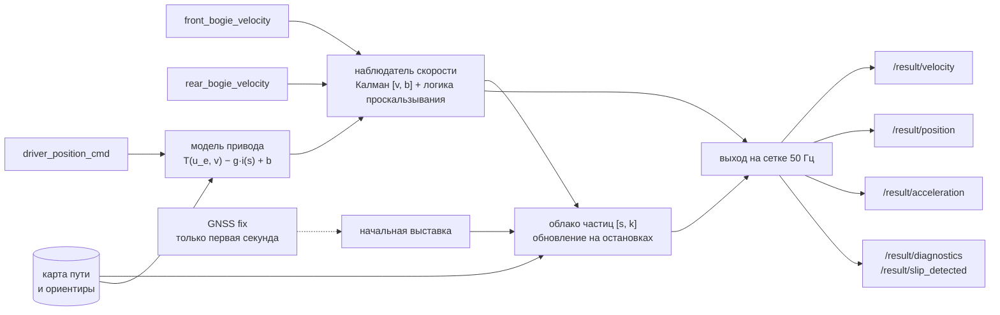

# Резервная одометрия трамвая по модели

Пакет ROS 2 Humble, который по трём внутренним сигналам (позиция контроллера водителя, скорость передней и задней тележек) в реальном времени оценивает ускорение, скорость и положение трамвая без GNSS и IMU. GNSS используется только в первую секунду для начальной выставки, после чего подписки на него уничтожаются.

Решение состоит из трёх связанных частей:

1. **Нелинейная модель тягового привода и продольной динамики**: табличная характеристика `T(u, v)`, апериодическое звено привода, уклон пути из карты, адаптивная поправка.
2. **Наблюдатель скорости** (фильтр Калмана `[v, b]`) с распознаванием юза, боксования, отказа датчика и экстренного торможения.
3. **Привязка к карте пути**: осевая линия, построенная офлайн по RTK обучающих поездок, и облако частиц по дуговой координате и масштабу колёс, которое уточняется на каждой остановке у платформы.

## Результаты

Проверка без подглядывания: для каждой записи карта строится **без всех записей того же дня** (leave-one-day-out), затем запись проигрывается через тот же код, что работает в узле, и выход сравнивается с GNSS так, как описано в правилах судьи (по `header.stamp`, допуск 0,05 с, ENU от первого фикса master). 97 уникальных записей (25 побайтных дублей из 122 исключены), 78 с GNSS, 3,9 млн пар для положения.

| Метрика | Итог | Без ориентиров остановок | Прежняя версия репозитория |
|---|---:|---:|---:|
| СКО скорости, медиана по записям | **0,034 м/с** | 0,035 м/с | 0,036 м/с |
| СКО скорости, все пары без сбоев эталона | **0,039 м/с** | 0,046 м/с | нет данных |
| СКО скорости, все пары | 0,113 м/с | 0,116 м/с | 0,131 м/с |
| Систематическое смещение скорости | **0,000 м/с** | −0,003 м/с | нет данных |
| СКО положения 3D, медиана по записям | **2,09 м** | 4,86 м | 8,97 м |
| СКО положения 3D, все пары | **6,97 м** | 16,40 м | 21,99 м |
| Вдольпутевая СКО, медиана | **1,55 м** | 4,25 м | нет данных |
| Поперечная СКО, медиана | 1,21 м | 1,41 м | нет данных |
| Дрейф в конце поездки, медиана | **0,020 % пути** | 0,137 % | нет данных |
| Ошибка в конце поездки, медиана | **0,99 м** | 6,79 м | нет данных |
| Частота выхода в ROS 2 | 48 Гц (сетка 50 Гц) | | ~19 Гц |
| Задержка «вход → публикация» через DDS, p50 / p99 / максимум | 3,2 / 8,2 / 35 мс | | не измерялась |
| Память узла / загрузка CPU | 65 МБ / 13 % одного ядра | | не измерялись |

«Все пары» включают сбои самого эталона: провалы скорости GNSS в ноль на ходу и скачки его метки времени на ±1 с. Их никакое решение не повторит, поэтому отдельно приведена метрика без них. В записях 30639 от 5 мая антенна master работает без RTK и уходит на 10..30 м (база master и rover плавает до 32 м вместо 12,4), это основной вклад в хвост распределения положения.


Вклад каждой части (все пары, отложенные дни): без карты положение уходит на километры, потому что из трёх скалярных сигналов повороты не восстановить; карта без ориентиров даёт 16,4 м; ориентиры с фильтром Калмана 8,1 м; облако частиц 6,97 м. Подробности в [`reports/ablation.json`](reports/ablation.json).

## Быстрый старт для жюри

Ubuntu 22.04, ROS 2 Humble, внешний интернет не нужен.

```bash
source /opt/ros/humble/setup.bash
git clone https://github.com/temurysega/odometria.git odometria_ws && cd odometria_ws
colcon build --symlink-install
source install/setup.bash
ros2 launch odometria odometria.launch.py
```

Пакет `tram_vehicle_msgs` из архива организаторов в чистом Humble не собирается: в его `package.xml` нет обязательного поля maintainer, и `colcon build` падает. В репозитории это поле добавлено, определения сообщений не менялись.

Во втором терминале воспроизвести любую запись:

```bash
source /opt/ros/humble/setup.bash && source odometria_ws/install/setup.bash
ros2 bag play /path/to/data/30618_01f73500
```

Выходные топики:

| Топик | Тип | Содержимое |
|---|---|---|
| `/result/velocity` | `tram_vehicle_msgs/VelocitySensor` | продольная скорость, м/с |
| `/result/position` | `nav_msgs/Odometry` | положение ENU (x восток, y север, z верх) от первого фикса master, курс по карте, скорость, угловая скорость по кривизне пути, ковариации |
| `/result/acceleration` | `geometry_msgs/AccelStamped` | продольное ускорение, м/с² |
| `/result/slip_detected` | `std_msgs/Bool` | флаг проскальзывания |
| `/result/diagnostics` | `diagnostic_msgs/DiagnosticArray` | состояние тележек, коэффициенты проскальзывания, использованное сцепление, масштаб колёс, СКО, число привязок, время обработки |

Метки времени: `header.stamp` в шкале заголовков входных сообщений тележек, на сетке 20 мс. Эпохи GNSS лежат ровно на сетке 0,1 с, поэтому каждой эпохе эталона соответствует выход ровно в тот же момент. `frame_id` положения `map` (локальная ENU), `child_frame_id` `base_link`.

Проверка реального времени на стенде (третий терминал, до запуска `ros2 bag play`):

```bash
ros2 run odometria latency_probe --ros-args -p output_file:=/tmp/latency.json
ros2 topic hz /result/velocity
ros2 topic echo /result/diagnostics --once
/usr/bin/time -v ros2 run odometria odometry_node   # пиковая память процесса
```

`latency_probe` считает задержку каждого выходного сообщения от последнего входного по монотонным часам и частоту обоих выходов. Параметры узла в [`src/odometria/config/odometria.yaml`](src/odometria/config/odometria.yaml).

Метрики точности по собственному прогону: записать выход вместе с эталоном и посчитать тем же кодом, что в отчётах.

```bash
ros2 bag record -o run /result/velocity /result/position /sensing/gnss/master/fix /sensing/gnss/master/vel /sensing/gnss/rover/fix
python3 tools/evaluate_recording.py run      # нужен numpy
```

Весь сценарий (сборка, узел, проигрывание, запись, замеры) собран в [`tools/ros_check.sh`](tools/ros_check.sh) и запускается в официальном образе:

```bash
docker run --rm -v $PWD:/repo:ro -v /path/to/data:/bags:ro -v /tmp/out:/out ros:humble bash /repo/tools/ros_check.sh
```

## Что показал анализ данных

Разбор всех 122 записей определил архитектуру. Полный разбор в [`docs/DATASET.md`](docs/DATASET.md), здесь главное.

**Единицы и время.** Скорость тележек записана в км/ч, хотя README датасета говорит о м/с: коэффициент 1/3,6 совпадает с GNSS с точностью 0,1 %. Заголовки колёс и GNSS в одной шкале времени, задержка колёс относительно скорости GNSS равна нулю с точностью 20 мс. Заголовок контроллера ставится на 50 мс позже. Эпохи GNSS строго на сетке 0,1 с.

**Одна линия.** Все поездки идут по одной двухпутной линии длиной 5,4 км с разворотными кольцами на концах. Каждая запись это рейс от кольца до кольца. Отсюда карта пути как замкнутый контур 11,06 км.


**Ориентиры.** Трамвай останавливается у платформ с разбросом 0,1..0,4 м (медианное отклонение), одинаково для обоих вагонов. 48 мест остановок стали ориентирами, по которым узел гасит вдольпутевой дрейф.

**Масштаб колёс гуляет.** Отношение пути по GNSS к пути по колёсам меняется от 0,985 до 1,016 по дням и вагонам (износ бандажей, калибровка). Без онлайн оценки это 80 м ошибки к концу рейса.


**Геодезия.** Сферическое приближение с радиусом 6371 км (оно было в прежней версии) на широте Москвы занижает расстояния по долготе на 0,34 %, до 15 м на длине линии. Узел считает ENU по эллипсоиду WGS84 через ECEF, как GeographicLib LocalCartesian.

**Антенны.** Rover стоит на 12,4 м впереди master, выбор антенны эталона даёт сдвиг 12 м. Узел выдаёт положение master, а при записи только с rover переключается на неё.

**Настоящие аномалии.** Юз одной тележки при торможении (колесо тормозит с темпом −6..−9 м/с²), боксование обеих тележек при разгоне (+3..4 м/с² при реальных +0,3), отказ датчика с залипанием в ноль и пропуском на 2 минуты, экстренное торможение до −5 м/с² при контроллере в нуле (рельсовые тормоза в сигнал контроллера не попадают), а также пропуски сообщений до 2 с.

**Аномалии эталона.** Скорость GNSS падает в ноль на ходу на десятки секунд, метка времени GNSS скачет на ±1 с на участках до минуты, в части записей master без RTK. Всё это видно при сравнении двух независимых источников (колёса и GNSS, master и rover) и учтено в методике оценки.

## Архитектура



Весь алгоритм находится в ядре `odometria/core.py` без зависимости от ROS. Узел `node.py` только переводит сообщения, а офлайн проигрыватель `tools/replay.py` вызывает то же ядро, поэтому цифры выше относятся ровно к коду узла. Зависимости узла: только стандартная библиотека Python и пакеты ROS.

## Математическая модель

### Тяговый привод

Позиция контроллера `u ∈ [−15, 15]` проходит через апериодическое звено привода:

```
du_e/dt = (u/15 − u_e) / τ,     τ = 0,4 с
```

Удельная сила тяги или торможения задана таблицей `T(u_e, v)` на сетке 31 × 13 (позиция × скорость до 17 м/с) с билинейной интерполяцией. Таблица подобрана регуляризованным МНК (вторые разности по обеим осям) по ускорению из сглаженной скорости колёс на участках, где тележки согласованы, по 89 записям. СКО ускорения на отложенных записях 0,171 м/с². В таблице видны нелинейности привода: ограничение мощности на высокой скорости, угасание электрического торможения на малой, особые позиции контроллера (положение −8 водители держат как выбег).


### Продольная динамика

```
dv/dt = T(u_e, v) − g · i(s) + b
```

`i(s)` уклон пути по карте (профиль высот сглажен медианой по 31 м, ограничен ±6 %; на линии уклоны до 3,6 %, это до 0,35 м/с²). Сопротивление качению и воздуха входит в таблицу, так как она подобрана по фактическому ускорению. `b` адаптивная поправка (масса, ветер, состояние рельсов), оценивается фильтром. На месте при `u ≤ 0` тормоза удерживают вагон.

Эта модель без колёс прогнозирует скорость с ошибкой 0,13 м/с через 1 с и 0,37 м/с через 3 с, в 3..4 раза точнее экстраполяции с постоянным ускорением.

### Наблюдатель скорости и проскальзывание

Фильтр Калмана с состоянием `x = [v, b]`, прогноз по модели, измерения каждой тележки по отдельности. Каждое измерение проверяется:

1. конечность и диапазон `[−3, 30]` м/с;
2. темп изменения колеса: выше `max(a_model, 0) + 1,6` м/с² это боксование, ниже −6 м/с² это юз (быстрее не тормозит даже экстренный тормоз);
3. согласие с другой тележкой: при плотном согласии (0,12 м/с) две независимые тележки принимаются даже вопреки модели, так проходит экстренное торможение, которого нет в сигнале контроллера;
4. при расхождении тележек выбирается та, которую режим не может исказить в её сторону: при тяге меньшая (боксование завышает), при торможении и выбеге большая (юз занижает); её вес снижается, так как проскальзывать могут обе;
5. невязка с прогнозом в адаптивном стробе `max(0,35; 4σ)`; отбракованная тележка возвращается только в узкой полосе у прогноза (гистерезис);
6. ровный ноль под тягой на ходу считается отказом датчика;
7. если обе тележки отбракованы дольше 4 с, фильтр пересинхронизируется, чтобы модель не уводила оценку.

Пока тележки недостоверны, скорость идёт по модели с замороженной поправкой, неопределённость растёт и отражается в ковариациях. В диагностике публикуются коэффициент проскальзывания каждой тележки `λ = (v_колеса − v)/max(v, 1)`, использованное сцепление `|a|/g`, поправка модели и масштаб колёс.


СКО скорости на записях с аномалиями колёс против среднего двух тележек: отказ задней тележки 0,051 против 0,584 м/с, залипание датчика в ноль на старте 0,035 против 0,208, юз 0,031 против 0,089, боксование 0,033 против 0,081.

### Положение

Карта: осевая master антенны, построенная по всем RTK фиксам обучающих поездок (медиана поперечных отклонений 1 см), и 48 ориентиров остановок с частотой и разбросом каждого.

Начальная выставка: первые фиксы master и rover дают начало ENU, курс по линии антенн и точку на карте. Выбирается путь того же направления (соседний путь в 4 м). Если стартовая точка вне карты (тупик конечной, обход внутри кольца), разница уходит в начальную неопределённость и плавно убирается на первых 80 м.

Вдоль пути состояние `[s, k]`: дуговая координата и масштаб колёс, `ds = k · v_колёс · dt`. Оно хранится облаком из 1500 частиц. Между остановками положение частицы выражается через пройденный колёсами путь, поэтому частицы трогаются только на остановках. На подтверждённой остановке вес частицы умножается на правдоподобие

```
L(s) = p_фон / 120 м + Σ доля_j · N(s − s_j, σ_j²)
```

где `s_j` ориентиры, `доля_j` частота остановок в этом месте, фон учитывает остановки у светофоров и в очереди. Неоднозначная остановка сохраняется как несколько гипотез, их разрешают следующие платформы. Оценка берётся по самой весомой группе частиц. За рейс масштаб колёс определяется с точностью около 0,1 %.


Выход: точка карты на дуге `s` (для rover плюс 12,4 м) в локальной ENU, курс по касательной, угловая скорость `v · κ(s)`. Ковариация положения раскладывается на вдольпутевую (из фильтра) и поперечную (точность карты).

## Проверка в ROS 2 Humble

Пакет собран `colcon build` в официальном образе `ros:humble` из чистого клона репозитория, узел запущен штатно, запись `30618_01f73500` проиграна в реальном времени (5 мин), выход записан `ros2 bag record` и сверен с GNSS:

| | Узел в ROS 2 | Ядро офлайн на том же отрезке |
|---|---:|---:|
| СКО скорости | 0,040 м/с | 0,040 м/с |
| СКО положения 3D | 1,20 м | 1,20 м |
| Дрейф | 0,019 % | 0,018 % |
| Частота `/result/velocity` и `/result/position` | 48 Гц | |
| Задержка «вход → публикация», p50 / p95 / p99 / максимум | 3,2 / 6,9 / 8,2 / 35 мс | |
| Пиковая память процесса (VmHWM) | 65 МБ | |
| Загрузка CPU | 13 % одного ядра | |

Выходы узла и офлайн ядра по совпадающим меткам различаются на 0,003 м/с (СКО): при живом проигрывании сообщения тележек и контроллера иногда приходят в другом порядке. После начальной выставки узел пишет в лог «GNSS отключён» и уничтожает подписки на GNSS.

Стресс: самая длинная запись `30618_27e994fc` (31,6 мин) целиком со скоростью ×4. Узел выдал 190 сообщений в секунду, задержка p99 7,8 мс, пиковая память 66,7 МБ против 65,4 МБ на пятиминутном прогоне (утечки нет), 44 % одного ядра. Точность та же, что у ядра офлайн: СКО положения 3,43 м против 3,44 м. Все замеры в [`reports/ros_check.json`](reports/ros_check.json).

## Реальное время и ресурсы

Замер ядра на самой длинной записи (31,6 мин), [`reports/benchmark.json`](reports/benchmark.json): обработка сообщения тележки p50 0,015 мс, p99 0,08 мс, максимум 5,9 мс (в момент начальной выставки), в 1095 раз быстрее реального времени, 0,1 % одного ядра, пиковая память Python 3,9 МБ. Узел однопоточный, публикует сразу в обработчике входного сообщения, без очередей и таймеров в пути данных, поэтому задержка «вход → публикация» определяется DDS. Долгие пропуски входа не останавливают выход: при молчании колёс публикация продолжается по модели от сообщений контроллера. Новая запись с другой шкалой времени распознаётся и оценка начинается заново без перезапуска узла.

## Параметры

| Параметр | По умолчанию | Смысл |
|---|---|---|
| `output_rate` | 50 | Гц, сетка выходных меток |
| `frame_id`, `child_frame_id` | `map`, `base_link` | кадры `Odometry` |
| `use_map` | true | false: относительная одометрия вдоль начального курса |
| `map_file`, `model_file` | встроенные | другая карта или таблица модели |
| `use_landmarks` | true | коррекция по местам остановок |
| `particles` | 1500 | 0: фильтр Калмана вместо облака частиц |
| `init_window` | 1,0 | с, окно начальной выставки GNSS (2 с при одной антенне) |
| `antenna_baseline` | 12,4 | м, rover впереди master |
| `scale_prior`, `scale_sigma` | 1,0; 0,008 | априорный масштаб колёс |
| `wheel_scale` | 1/3,6 | перевод значения датчика в м/с |
| `sigma_wheel`, `sigma_model`, `sigma_bias` | 0,03; 0,35; 0,02 | шумы фильтра скорости |
| `pair_abs`, `pair_tight` | 0,25; 0,12 | м/с, согласие тележек |
| `rise_margin`, `max_decel` | 1,6; 6,0 | м/с², пороги боксования и юза |
| `resync_after` | 4,0 | с, пересинхронизация |
| `stop_speed`, `stop_confirm` | 0,03; 1,0 | порог и подтверждение остановки |

Масса, радиус колеса и передаточные числа не задаются отдельно: табличная модель откалибрована в удельных величинах (м/с²), а масштаб колеса оценивается онлайн.

## Допущения и ограничения

1. Эталон судьи считается в локальной ENU WGS84 от первого валидного фикса master (rover, если master нет). Если жюри использует другое начало, достаточно сдвига, форма траектории не меняется.
2. Карта описывает одну линию. На неизвестном маршруте узел даёт относительную одометрию вдоль начального курса: скорость остаётся точной, положение нет.
3. На западной конечной несколько тупиковых путей. Путь, по которому трамвай встанет в конце рейса, заранее не известен, карта ведёт по самому частому.
4. Одинаковый юз обеих тележек с одинаковой скоростью неотличим от реального торможения без третьего источника. Узел ловит его по физическим пределам темпа.
5. Модель привода табличная и не учитывает историю позиций контроллера дольше τ. Градиентный бустинг с историей дал 0,144 м/с² против 0,171, но в узел он не взят ради простоты и прозрачности.

## План развития

Перенос ядра на C++ для бортового вычислителя; карта в формате pathgraph со стрелками и мультигипотезой на ветвлениях; дообучение карты и ориентиров на новых рейсах; оценка массы по тяговому усилию и сопротивления в кривых по кривизне карты; модель привода с памятью по истории контроллера; использование сигналов дверей для надёжной привязки к платформам; перенос масштаба колёс между рейсами одного вагона.

## Структура репозитория

```
src/odometria/                    пакет ROS 2 (ament_python)
  odometria/core.py               ядро: время, остановки, выход
  odometria/traction.py           модель привода и динамики
  odometria/observer.py           наблюдатель скорости и проскальзывание
  odometria/track.py              карта, начальная выставка, облако частиц
  odometria/geodesy.py            WGS84, ECEF, ENU
  odometria/node.py               узел ROS
  odometria/latency_probe.py      замер задержки и частоты
  odometria/data/                 карта пути и таблица модели
  launch/, config/                запуск и параметры
src/tram_vehicle_msgs/            сообщения из датасета
tools/                            офлайн инструменты (numpy, scipy, matplotlib)
tests/                            модульные тесты ядра
reports/                          отчёты оценки и бенчмарка
docs/                             разбор датасета, критерии, графики
```

Офлайн воспроизведение без ROS:

```bash
pip install numpy scipy matplotlib
python tools/build_map.py DATA --cache CACHE                  # карта и ориентиры
python tools/fit_traction.py DATA --cache CACHE               # таблица модели
python tools/replay.py DATA --cache CACHE --output reports/replay.json
python tools/benchmark.py DATA/30618_27e994fc --cache CACHE
python tools/plots.py DATA --cache CACHE
python -m unittest discover -s tests
```

Для отложенной проверки карты строятся без одного дня (`build_map.py --exclude-days 2026-07-27 --output maps/map_2026-07-27.json`), затем `replay.py --day-maps maps`. Соответствие критериям кейса собрано в [`docs/CRITERIA.md`](docs/CRITERIA.md).
